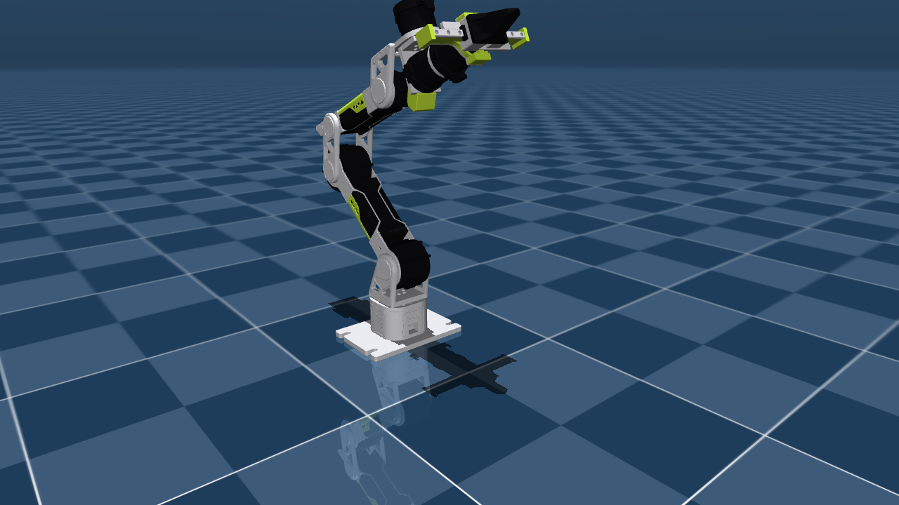
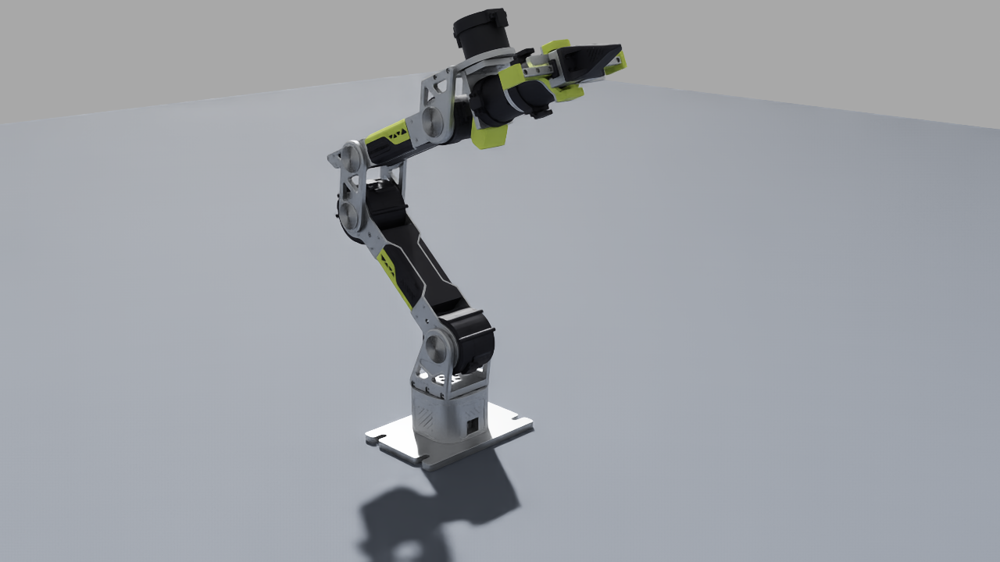

# reBot DevArm — render gallery

The RS reBot DevArm at the elbow-up "L" pose, rendered from the assets in this
repository across three physics engines. The arm is coloured by mesh name
(lime accent covers, black motors and gripper, aluminium brackets); the source
URDF stores every visual as flat grey.

| MuJoCo (`mjcf/rebot_devarm`) | Isaac Sim — PhysX (`usd/RS-rebot-dev-arm`) | Isaac Sim — Newton |
|:---:|:---:|:---:|
|  |  |  |

All three (plus standalone Newton and Pinocchio) agree on the generalized
gravity torque g(q) to under 6e-6 N·m — see
[`mjcf/rebot_devarm/PARITY.md`](../../mjcf/rebot_devarm/PARITY.md).
