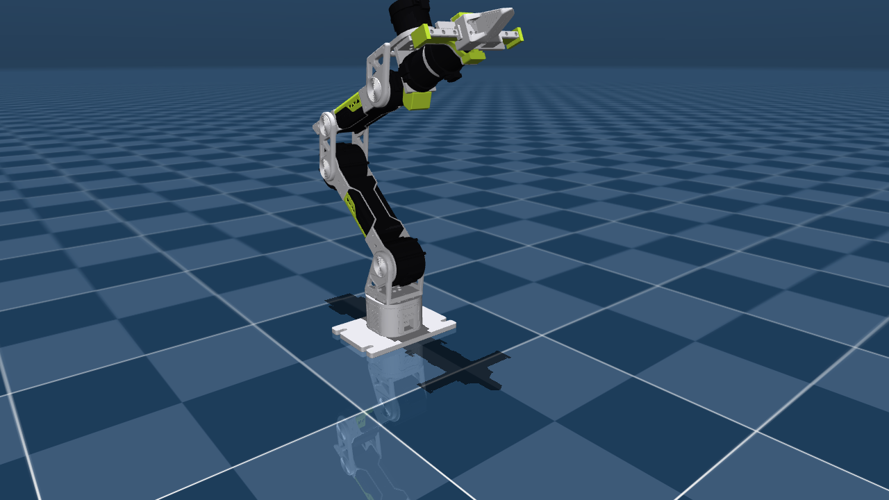
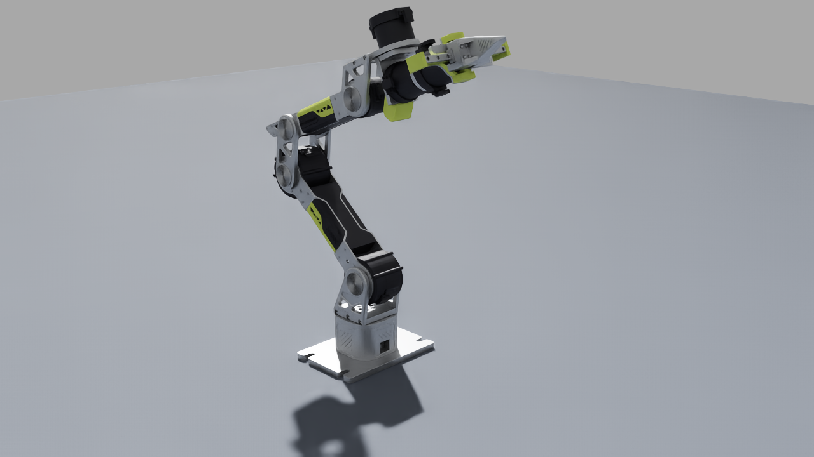

# reBot DevArm (RobStride) — MJCF

MuJoCo model of the Seeed reBot DevArm, RobStride build (6 revolute joints +
2-finger parallel gripper, 8 DOF). Generated from
[`urdf/00-arm-rs_asm-v3`](../../urdf/00-arm-rs_asm-v3) so it stays in lockstep
with the URDF and the Isaac Sim USD asset.

<p float="left">
  
  
  
</p>

*Same arm, same raised pose across three engines — MuJoCo, Isaac Sim PhysX,
Isaac Sim Newton. The lime covers / black motors / aluminium are recovered
from the mesh filenames (the URDF stores every visual as flat grey).*

## Files

| file | description |
|---|---|
| `rebot_devarm.xml` | the model: bodies, joints, inertials, visual + convex-collision geoms, position actuators, `home` / `raised` keyframes |
| `scene.xml` | `rebot_devarm.xml` + floor, lights, skybox |
| `assets/` | visual meshes (`*.STL` / `*.obj`) and coacd convex-collision meshes (`*_convex.stl`) |
| `build_mjcf.py` | regenerates `rebot_devarm.xml` from the URDF |
| `parity_mujoco_vs_pinocchio.json` | gravity-parity evidence |

## Provenance & correctness

Built with [discoverse-dev/urdf-to-mjcf](https://github.com/discoverse-dev/urdf-to-mjcf)
(`-ct convex_hull`) for the body tree + coacd convex collision, then
`build_mjcf.py` layers on: fixed base, `base_link` inertial, joint
armature/damping, position actuators with the hardware-validated PD gains
(rs-06 shoulder/elbow, rs-00 wrist, gripper), and keyframes.

Every link keeps its **exact URDF inertial**, and `gripper_end` is kept as a
**separate welded body** rather than merged into `link6`. This matters:
MuJoCo's own URDF importer mis-rotates the `gripper_end` fixed-joint inertial
(it drops the joint's rpy `3.1416 -1.5708 0`), putting the merged CoM at
`[-0.098, -0.144, 0.002]` instead of `[0, 0, 0.047]` and inventing a ~1 N·m
phantom gravity torque on joint6. Keeping the body separate avoids it.

## Gravity parity

`qfrc_bias` (rest) vs Pinocchio `g(q)` from the same URDF, over 5 poses:

**max |MuJoCo − Pinocchio| = 5.9e-6 N·m**

Pinocchio is the cross-checked reference — it agrees with Isaac Sim (PhysX and
Newton) drive droop and with the real-arm PD-sweep measurements to 3 digits.
So this MJCF is gravity-consistent with the URDF, the USD asset, and hardware.

Reproduce: `python parity_mujoco_vs_pinocchio.py` (numbers in the JSON).

## Conventions

- `angle="radian"`, meters, `meshdir="assets"`.
- Joint sign convention follows the repo URDF: joint2/3 ∈ [−π, 0], joint4 ∈
  [−1.79, 1.69]. (The Seeed vendor control URDF mirrors all six axes;
  `q_repo = −q_vendor`.)
- Total mass 6.0085 kg. `home` = arm extended (URDF zero); `raised` = elbow-up
  L pose used for gravity validation.

## Load

```python
import mujoco
m = mujoco.MjModel.from_xml_path("scene.xml")
d = mujoco.MjData(m)
mujoco.mj_resetDataKeyframe(m, d, m.key("raised").id)
```
